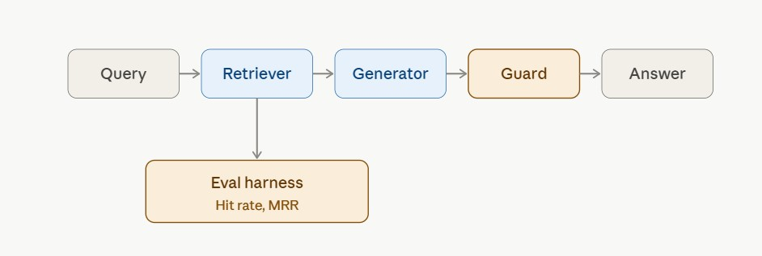

# Talk to My Notes

A RAG (Retrieval-Augmented Generation) system built over my own college notes — OOPs, DBMS, SQL, Git, HTML, and Machine Learning. Beyond basic question-answering, this project focuses on two things most RAG demos skip: measuring whether retrieval is actually working, and checking whether generated answers are actually grounded in the source material.

Notes are indexed at build time (chunked, embedded, and stored in a vector index) rather than uploaded through the interface — this is a personal assistant over a fixed set of notes, not a multi-user upload tool.

**Live demo:** *[(deployed link)](https://talk-to-my-notes-rag.streamlit.app/)*
**Source code:** *[(GitHub link)](https://github.com/Kumkummm-20/Talk-to-my-notes)*

## Architecture

A query is embedded and matched against indexed note chunks using FAISS. The top matches are passed to an LLM to generate an answer, which is then checked by a separate model call for grounding before being shown to the user. The same retriever also feeds a labeled evaluation set used to measure retrieval quality independently of generation.
1. **Simple Architecture:**
   
   Query → Retriever → Generator → Guard → Answer

2. **Detailed Architecture**
PDFs
 ↓
Chunking
 ↓
Embeddings
 ↓
FAISS

          Query
            ↓
     Query Embedding
            ↓
        Retriever
        ↙       ↘
  Evaluation   Generator
                 ↓
               Guard
                 ↓
               Answer



## Why this project is different from a basic RAG demo

Most RAG tutorials stop at "it retrieves something and generates an answer." Two problems with that: you have no way to know if retrieval is actually finding the right information, and you have no way to catch the model quietly answering from its own training data instead of your notes. This project addresses both:

- A retrieval evaluation harness that measures Hit Rate@k and MRR against a labeled question set
- A hallucination guard that runs a second, independent model call to verify every generated answer is supported by the retrieved context

## Evaluation results

Evaluated on a 15-question labeled set spanning all six note topics. A retrieved chunk counts as correct if it comes from the right source file and contains a distinctive keyword tied to that question.

| Config | Hit Rate@k | MRR |
|---|---|---|
| chunk_size=120, overlap=20, k=5 | 0.933 | 0.822 |
| chunk_size=120, overlap=20, k=10 | 0.933 | 0.822 |

Raising k from 5 to 10 didn't change either metric. The one remaining miss (a question about access modifiers) isn't a ranking problem — the correct chunk doesn't surface even in the top 10 — which points to a mismatch between how the question is phrased and how the notes describe that concept, not a shortage of candidates. Given identical accuracy, k=5 was kept as the final setting since it sends less context per query, which means lower latency and lower token cost.

## Limitations

**OCR on handwritten notes.** Several source PDFs are handwritten and had to go through OCR (Tesseract) rather than direct text extraction. Output quality varied a lot by handwriting clarity — one short file came out unusable and was manually retyped as a clean text file. A longer handwritten file was left out of the evaluation set rather than retyped by hand, and is flagged here as an open item. A vision-based transcription approach would likely handle this better than Tesseract for handwriting specifically.

**Hallucination guard is LLM-as-judge, not a trained classifier.** Using a second model call to check grounding is simple to implement and works well in practice, but it costs an extra API call per answer. A smaller, fine-tuned classifier would be cheaper to run at scale, though it would need labeled training data to build.

**Evaluation uses keyword matching, not exact chunk IDs.** Correctness in the eval harness is decided by checking source file + a distinctive keyword, rather than manually tagging exact ground-truth chunk IDs. This is precise enough to compare configurations against each other, which is what the harness is actually for, but it's an approximation worth being upfront about.

## Stack

| Component | Tool | Reason |
|---|---|---|
| Embeddings | sentence-transformers (MiniLM) | Small, fast, runs on CPU |
| Vector search | FAISS (IndexFlatIP) | Exact search, no approximation needed at this scale |
| Generation + grounding check | Groq API (Llama 3.3 70B) | Fast inference, free tier |
| OCR | Tesseract + pdf2image | Needed for handwritten note sources |
| Interface | Streamlit | Fast to build a usable UI without frontend code |
| Hosting | Streamlit Community Cloud | Free, deploys directly from GitHub |

## Setup

```bash
git clone <your-repo-url>
cd rag-eval-guard
python -m venv venv

# Windows
venv\Scripts\activate
# macOS/Linux
source venv/bin/activate

pip install -r requirements.txt
```

Get a Groq API key at https://console.groq.com/keys, then copy `.env.example` to `.env` and add it.

If you're on Windows and working with handwritten/scanned PDFs, you'll also need Tesseract OCR (https://github.com/UB-Mannheim/tesseract/wiki) and Poppler (https://github.com/oschwartz10612/poppler-windows/releases) installed and added to your system PATH.

## Pipeline

**1. Ingestion** (`src/ingest.py`) — reads every file in `data/`. For PDFs, tries direct text extraction first; if a page returns almost no text, treats it as a scanned image and runs OCR on it instead.
```bash
python -m src.ingest
```

**2. Chunking** (`src/chunk.py`) — splits documents into overlapping ~120-word chunks so ideas aren't cut off mid-sentence between chunks.
```bash
python -m src.chunk
```

**3. Embedding and indexing** (`src/embed_index.py`) — embeds every chunk with MiniLM and stores the vectors in a FAISS index.
```bash
python -m src.embed_index
```

**4. Retrieval** (`src/retrieve.py`) — embeds a query and returns the most similar chunks from the index. Used by both the app and the eval harness.
```bash
python -m src.retrieve
```

**5. Generation** (`src/generate.py`) — sends the retrieved chunks and question to Groq with an instruction to answer only from the given context.
```bash
python -m src.generate
```

**6. Evaluation** (`src/eval.py`) — runs a labeled question set through the retriever and computes Hit Rate@k and MRR.
```bash
python -m src.eval
```

**7. Hallucination guard** (`src/guard.py`) — an independent model call that checks whether the generated answer is actually supported by the retrieved context, flagging any unsupported claims.
```bash
python -m src.guard
```

**8. Application** (`app.py`) — combines all of the above into a Streamlit interface: ask a question, see the answer with a grounding indicator, inspect retrieved chunks, browse past questions from the sidebar, and re-run the evaluation harness on demand.
```bash
streamlit run app.py
```

## Deployment

1. Push this repo to GitHub (`.env` and `venv/` are already excluded via `.gitignore`)
2. On https://share.streamlit.io, connect the repo and set `app.py` as the entry point
3. Add `GROQ_API_KEY` under the app's Secrets settings
4. Deploy

## Command reference

```bash
python -m src.ingest          # load and OCR documents
python -m src.chunk           # split into chunks
python -m src.embed_index     # build the FAISS index
python -m src.retrieve        # test retrieval
python -m src.generate        # test generation
python -m src.eval            # run Hit Rate + MRR evaluation
python -m src.guard           # test the hallucination guard
streamlit run app.py          # launch the app
```
